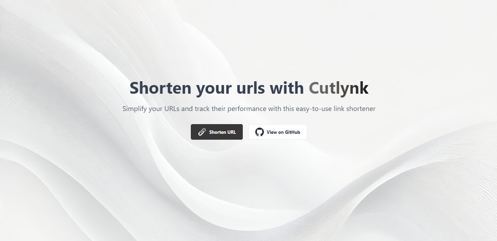

<!-- PROJECT LOGO -->

<a href="">
  
</a>

<!-- ABOUT THE PROJECT -->

# Cutlynk

Cutlynk is a fast and secure URL shortener built with Angular. It simplifies the process of converting long URLs into concise links, making sharing easier than ever. Enjoy a user-friendly interface and robust performance while keeping your data safe.

<!-- TABLE OF CONTENTS -->

## 🚩 Table of Contents

- [Built With](#built-with)
- [Getting Started](#getting-started)
- [Contributing](#contributing)
- [License](#license)

### 🛠️ Built With <a id='built-with'></a>

- [![Angular][Angular.io]][Angular-url]
- [![Taiga UI][Taiga-ui]][Taiga-url]
- [![Tailwind CSS][Tailwind]][Tailwind-url]
- [![Appwrite][Appwrite]][Appwrite-url]

[Angular.io]: https://img.shields.io/badge/Angular-DD0031?style=for-the-badge&logo=angular&logoColor=white
[Angular-url]: https://angular.io/
[Taiga-ui]: https://img.shields.io/badge/Taiga%20UI-ff7043?style=for-the-badge&link=https://taiga-ui.dev/
[Taiga-url]: https://taiga-ui.dev/
[Tailwind]: https://img.shields.io/badge/Tailwind_CSS-38B2AC?style=for-the-badge&logo=tailwind-css&logoColor=white
[Tailwind-url]: https://tailwindcss.com/
[Appwrite]: https://img.shields.io/badge/Appwrite-%23FD366E.svg?style=for-the-badge&logo=appwrite&logoColor=white
[Appwrite-url]: https://appwrite.io/

<!-- GETTING STARTED -->

## ⭐ Getting Started <a id='getting-started'></a>

1. Clone the repository:

```bash
https://github.com/javiermartins/cutlynk.git
```

2. Install dependencies:

```bash
npm install
```

3. Run the development server:

```bash
ng serve
```

You can access the website by visiting http://localhost:4200 in your browser.

<!-- CONTRIBUTING -->

## 💬 Contributing <a id='contributing'></a>

Contributions make the open-source community great. Any help is **appreciated**!

To suggest improvements, fork the repo and create a pull request or open an "enhancement" issue. Don’t forget to star the project!

### How to Contribute

1. Fork the Project
2. Create a Feature Branch (`git checkout -b feature/changes`)
3. Commit Changes (`git commit -m 'Some changes'`)
4. Push the Branch (`git push origin feature/changes`)
5. Open a Pull Request

Thanks for contributing!

<!-- LICENSE -->

## 📜 License <a id='license'></a>

This software distributed under the [Apache License 2.0](https://github.com/javiermartins/cutlynk/blob/master/LICENSE)
